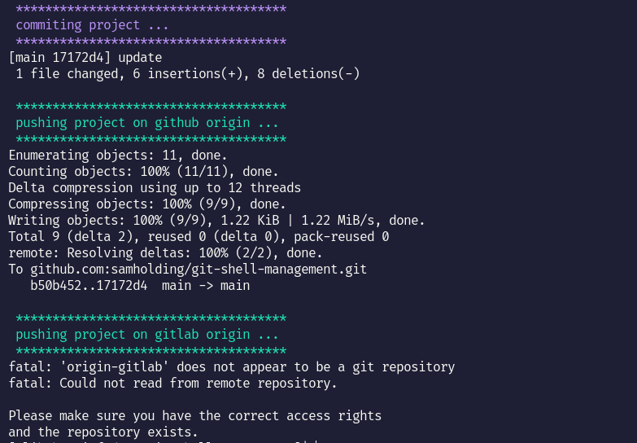

# git-shell-management
git shell management help you push and commit your code in two origin with in command .



# how it work 

1. copy dir shell in your root directory project 
2. adding main origin to commit.sh   : origin
3. adding second origin to commit.sh : origin-gitlab
4. then run command : 

this command commit and push automaticlly :

```bash
    bash ./shell/commit.sh "your message" update master
```

this command push only :

```bash
    bash ./shell/push.sh master
```